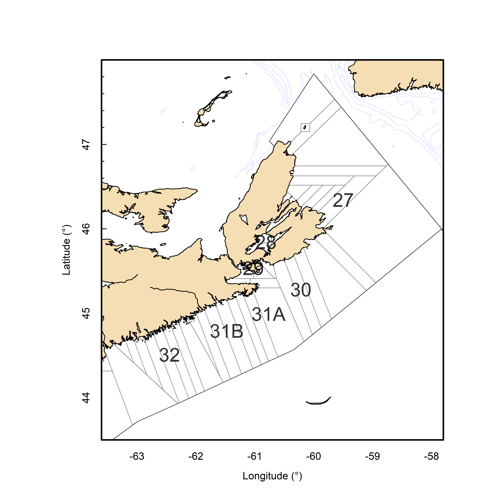

# Background

## Description of the fishery

The commercial fishery for American Lobster has been active for over 100 years in LFAs 27-32. Lobster Fishing Areas (LFAs) 27-32 cumulatively cover 62,800 km2 from Cape Breton to Hartland Point. Although the LFAs extend out to 92 km (50 nautical miles), colder water temperatures with increasing depth generally limit fishing to 5 km off shore in northern Cape Breton and to within 20 km from shore in the south. The fishery is effort controlled, with restrictions on the number of licenses, number of traps per license (250 in LFA 28-32 or 275 in LFA 27), MLS (82.5 mm in LFA 27, 30-32 and 84 mm in LFAs 28 and 29), and non-retention of berried females (Cook et al. 2018).


```{r codemap, include = FALSE}

	p = bio.lobster::load.environment()
	require(SpatialHub)
	require(lubridate)
	
	la()

		assessment.year = p$current.assessment.year 
		p$current.assessment.year = p$current.assessment.year - 1 


	    
    	p$lfas = c("27", "28", "29", "30", "31A", "31B", "32") # specify lfas for data summary
    	p$subareas = c("27N","27S", "28", "29", "30", "31A", "31B", "32") # specify lfas for data summary

	    # update data through ROracle
	    NewDataPull =F
	    if(NewDataPull){
    lobster.db('fsrs.redo')
	  lobster.db('logs.redo')
	    lobster.db('annual.landings.redo')
	    lobster.db('vlog.redo')
	    logs=lobster.db('process.logs.redo')
	    }

		
#	 png(filename="MapLFA2732.png",width=6.5, height=6.5, units = "in", res = 800)
	# LobsterMap('27-32')
	 #dev.off()
```


```{r ,fig.cap="Map of Lobster Fishing Areas (LFAs) 27-32 with logbook reporting grids outlined in grey."}

```


